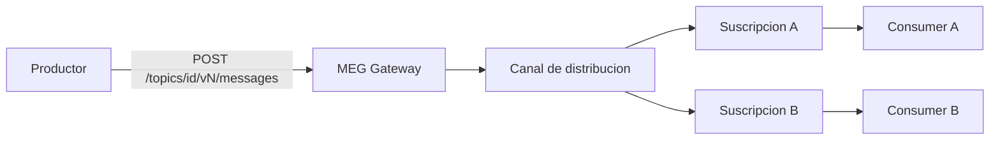
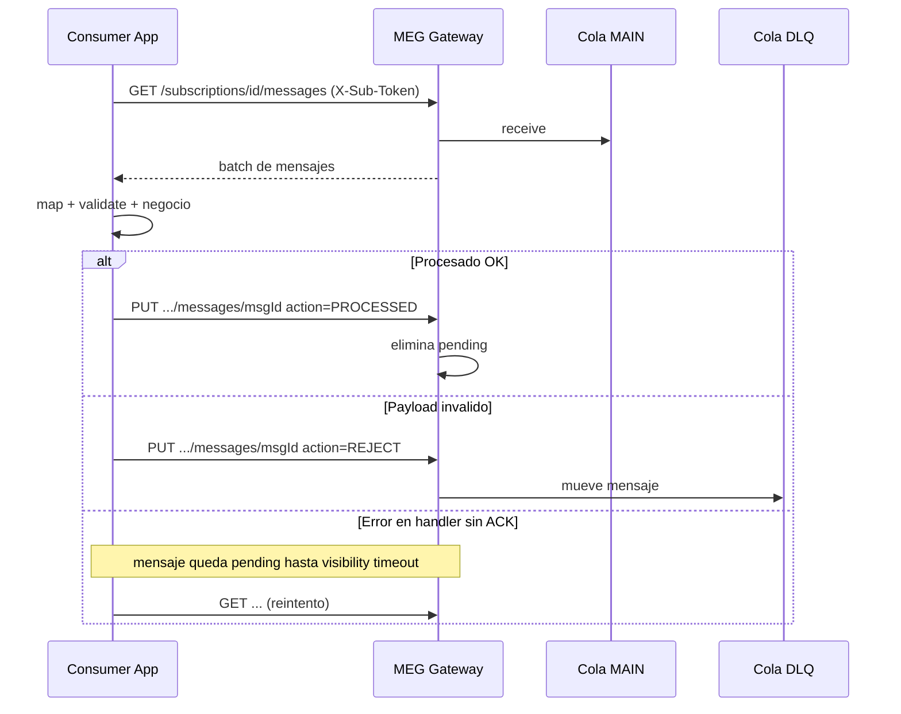
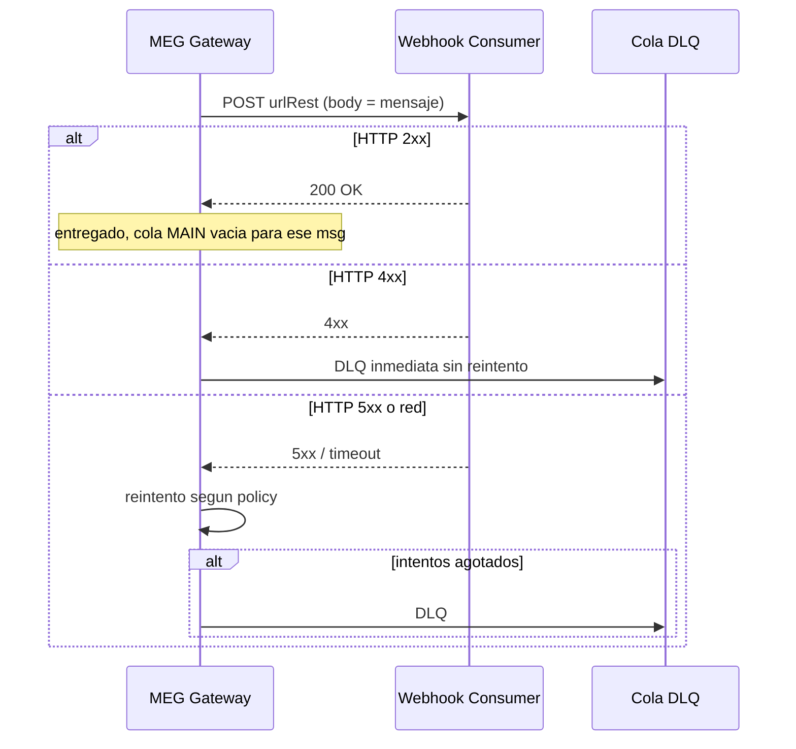
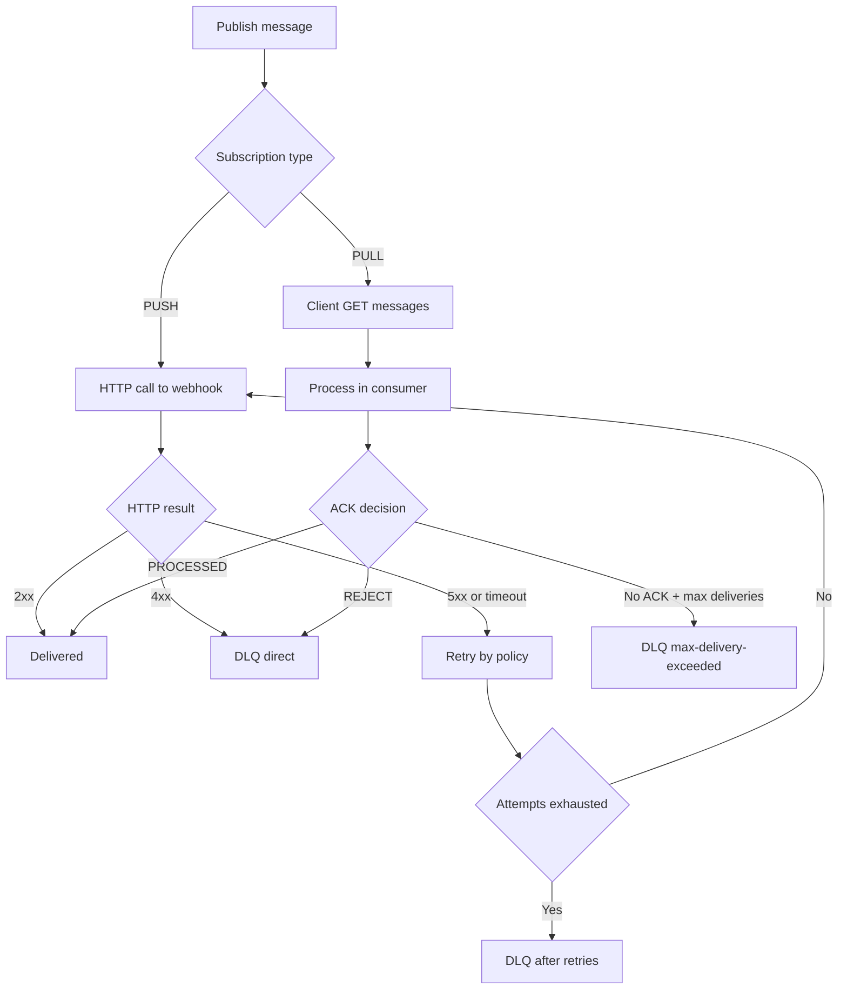

# 01 — Patrones de integración: PUSH vs PULL

## Modelo funcional

1. El **productor** publica en un **topic/version** con headers de trazabilidad e idempotencia.
2. El gateway persiste auditoría, valida schema (si está configurado) y publica en RabbitMQ.
3. Cada **suscripción** tiene su cola (`deliveryChannel`) y su DLQ (`deadLetterChannel`).
4. El **consumer** recibe el mensaje por **PULL** (poll HTTP) o **PUSH** (webhook HTTP desde el gateway).

Referencia: [`SPEC.md` §3](../SPEC.md).

## Semántica de entrega: at-least-once

MEG garantiza **at-least-once**, no exactly-once:

- Un mismo mensaje puede entregarse **más de una vez** (reintentos, visibilidad PULL, reintentos PUSH).
- **Todo consumer debe ser idempotente** en efectos de negocio (DB, APIs externas, otro publish).

## PUSH vs PULL: cuándo usar cada uno

| Criterio | PULL | PUSH |
|----------|------|------|
| Quién inicia la entrega | El consumer (cron/poll) | El gateway (scheduler → POST a `urlRest`) |
| Acoplamiento temporal | Consumer controla ritmo | Gateway empuja al ritmo del scheduler |
| Infra expuesta | Solo salida HTTP hacia MEG | Webhook HTTP expuesto y estable |
| Reintentos / resiliencia | Visibilidad + `maxDeliveryCountPull` | Resilience4j + política HTTP 4xx/5xx |
| Estado operativo en deploy | `INACTIVE` bloquea pull (403) | Scheduler sigue intentando salvo pausa técnica |
| Caso típico | Batch, backoffice, procesos programados | Notificaciones en tiempo casi-real, webhooks |

**Regla práctica:** si la app ya expone HTTP y puede recibir callbacks de forma confiable → PUSH. Si preferís controlar cuándo y cuánto procesás → PULL.

## Flujo PULL

### Visibilidad y reentregas

- Al hacer pull, el mensaje queda **invisible** otros consumidores durante `meg.pull.visibility-timeout-seconds` (default 10 s) hasta ACK o timeout.
- Si no hay ACK, vuelve a estar disponible → **reintento**.
- Si `deliveryCount >= maxDeliveryCountPull` (default 10, configurable por suscripción) → **DLQ automática** con `dlqReason=max-delivery-exceeded` (poison message).

### ACK explícito

- `PROCESSED`: confirmación de éxito; el mensaje no se reentrega.
- `REJECT`: rechazo definitivo del payload/procesamiento → **DLQ** inmediata.

## Flujo PUSH

### Clasificación HTTP en PUSH (regla clave)

| Respuesta del webhook | Interpretación | Acción MEG |
|----------------------|----------------|------------|
| **2xx** | Éxito | Mensaje considerado entregado |
| **4xx** | Error **permanente** del consumer (payload, auth, regla de negocio no recuperable) | **DLQ inmediata**, sin reintento |
| **5xx**, timeout, error de red | Error **transitorio** | Reintentos según `meg.push.max-delivery-attempts` o `conf-resilience.retry.maxAttempts` → luego **DLQ** |

**Por qué importa:** un 400 mal modelado como 500 generará reintentos innecesarios; un 500 respondido como 400 mandará a DLQ sin dar oportunidad de recuperación.

Header de control en reintentos PUSH: `x-meg-push-attempt`.

## Flujo de decisión de errores (resumen)

## DLQ y reproceso

- **Listar:** `GET /subscriptions/{id}/dead-letters`
- **Reencolar:** `POST /subscriptions/{id}/dead-letters/{messageId}/requeue` (requiere `X-Sub-Token`)

Reencolar **no** corrige la causa raíz: solo devuelve el mensaje a la cola principal para un nuevo ciclo de entrega.

## Poison messages (PULL)

Un mensaje es “veneno” cuando:

- Falla validación repetidamente → muchos pulls sin ACK hasta `maxDeliveryCountPull`.
- El handler lanza excepción sistemáticamente (bug, dependencia caída permanente).

El gateway lo mueve a DLQ con motivo documentado. El equipo debe **corregir código/datos** antes de requeue masivo.

## Ejemplo del sample (responsabilidades separadas)

| Suscripción | Tipo | Responsabilidad |
|-------------|------|-----------------|
| `pago-reintegros` | PULL | Monto estándar: pagar y publicar confirmación |
| `pago-reintegros-alto-monto` | PULL | Monto alto: pagar y publicar en otro topic |
| `pago-reintegros-push` | PUSH | Webhook de demo |

Ver diagrama en [`sample-consumer` README](https://github.com/cochiss/sample-consumer/blob/main/README.md).

## Próximo paso

[02 — Buenas prácticas de consumo y traza](02-buenas-practicas-consumo-y-traza.md)
