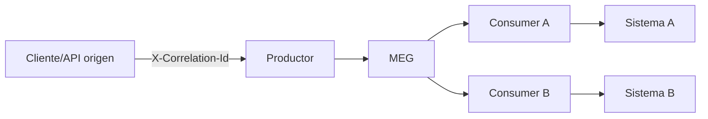

# 02 — Buenas prácticas de consumo, trazabilidad e idempotencia

## 1. Responsabilidad por consumer

Principio base: **una suscripción, una responsabilidad de negocio**.

- Una suscripción no debería mezclar validación, pago, notificación, auditoría y ruteo “todo junto”.
- Dividir por propósito mejora trazabilidad, operación y testeo.
- En MEG esto se modela naturalmente: un topic puede tener varias suscripciones independientes.

Ejemplo del sample:

- `pago-reintegros`: procesa flujo estándar.
- `pago-reintegros-alto-monto`: procesa alto monto en circuito separado.
- `notificacion-pago-reintegros`: consume solo confirmaciones para notificar.

## 2. `eventType`: para qué sirve realmente

`eventType` identifica el **hecho de negocio** que representa el mensaje.

Buenas prácticas:

- Nombrarlo en lenguaje de dominio (`pago.reintegro.confirmado`, `solicitud.reintegro.alto-monto.detectada`).
- Mantener semántica estable; no usarlo como “flag técnico”.
- No meter versión en el nombre (`eventVersion` ya existe para eso).

Qué evita:

- Consumers acoplados a productores específicos.
- Lógica de parseo por “if/else de app origen” en vez de eventos de dominio.

## 3. `X-Correlation-Id`: traza end-to-end

Es el identificador transversal para seguir un flujo distribuido completo.

Con un solo `correlationId` podés reconstruir:

- solicitud inicial,
- publicación en MEG,
- procesamiento por consumers,
- llamadas aguas abajo,
- fallos y retries.

Regla: **si no hay correlation id consistente, no hay trazabilidad operativa real**.

## 4. `Idempotency-Key`: cómo funciona y por qué es clave

En publish, MEG deduplica por `(topicId, topicVersion, idempotencyKey)`.

- Mismo key para mismo topic/version => no duplica evento lógico.
- Retorna el `messageId` ya existente (`deduplicated=true`).
- Evita duplicados por retries del productor ante timeout/red.

Qué no resuelve:

- No garantiza exactly-once en consumers.
- Cada consumer debe ser idempotente en su propia lógica de negocio.

Recomendación práctica:

- Generar `Idempotency-Key` con base en clave funcional estable (ej. `operacionId`) y no solo UUID aleatorio.

## 5. `X-Source-App`: ownership y observabilidad

`X-Source-App` declara la app origen del evento.

Sirve para:

- segmentar métricas y dashboards por productor,
- acelerar incidentes (qué sistema originó el evento),
- habilitar políticas de gobierno (rate, prioridad, límites por fuente).

Sin `sourceApp`, la trazabilidad queda incompleta incluso con correlation id.

## 6. Diseño de payload y schemas

### Cuándo usar schema

- Para contratos críticos entre equipos (campos obligatorios, formatos, rangos).
- Para prevenir “drift” de payload en evoluciones.
- Para fallar temprano en publish (`400`) y no en runtime del consumer.

### Evolución recomendada

- Cambios compatibles: agregar campos opcionales.
- Cambios incompatibles: nueva versión (`v2`) de topic/contrato.
- No romper consumidores existentes sin estrategia de migración.

### Validación operativa

- Si schema está habilitado y payload no cumple: el mensaje no se publica.
- Consumers igual deben validar reglas de negocio (schema no reemplaza lógica funcional).

## 7. Programar para DLQ (no contra DLQ)

DLQ no es “basurero”; es mecanismo de contención y análisis.

Patrón recomendado:

1. Clasificar causa del fallo:
   - permanente (datos inválidos, regla de negocio no recuperable),
   - transitoria (timeout, dependencia caída).
2. Corregir causa raíz (código/config/datos).
3. Requeue selectivo o reproceso controlado.
4. Medir reincidencia y alertar.

Qué no hacer:

- requeue masivo “a ciegas”,
- ignorar DLQ en producción,
- tratar todo error como transitorio.

## 8. Checklist corto para equipos

Antes de publicar o consumir:

- [ ] `eventType` está definido en lenguaje de dominio.
- [ ] `X-Correlation-Id` se propaga de punta a punta.
- [ ] `Idempotency-Key` representa la operación lógica.
- [ ] `X-Source-App` identifica claramente al productor.
- [ ] El consumer implementa idempotencia de negocio.
- [ ] Hay política explícita para DLQ/requeue.
- [ ] El contrato schema/versionado está acordado con los consumidores.

## Próximo paso

[03 — Guía de uso de la librería pull-consumer-lib](03-guia-libreria-pull-consumer-lib.md)
