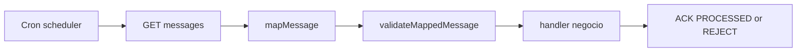

# 03 — Guía de uso de `pull-consumer-lib`

Esta guía explica cómo la librería abstrae el consumo PULL para que el equipo se enfoque en lógica de negocio, no en plumbing HTTP/ACK.

## 1. Qué abstrae la librería

Con `@MegPullSubscription` + `MegBasicPullConsumer`, la librería resuelve:

- scheduling por cron,
- GET de mensajes al gateway,
- envío de ACK `PROCESSED` / `REJECT` por item,
- manejo de casos típicos de mapping/validación.

Tu código queda en este pipeline:



## 2. Configuración YAML (configPrefix)

Ejemplo real (`sample-consumer/app/src/main/resources/application.yml`):

```yaml
sample:
  topics:
    in:
      reintegros:
        id: solicitudes-reintegros
        version: 1
        subscription:
          name-sub: pago-reintegros
          token: <X-Sub-Token>
          rows: 10
          cron: "*/10 * * * * *"
```

Con `@MegPullSubscription(configPrefix = "sample.topics.in.reintegros")`, la lib toma:

- `${prefix}.id`
- `${prefix}.version`
- `${prefix}.subscription.name-sub`
- `${prefix}.subscription.token`
- `${prefix}.subscription.rows` (opcional, default 10)
- `${prefix}.subscription.cron` (opcional, default `*/10 * * * * *`)

## 3. Consumer recomendado

Patrón recomendado:

1. extender `MegBasicPullConsumer<T>`
2. mapear raw message a modelo de dominio (`mapMessage`)
3. validar negocio (`validateMappedMessage`)
4. delegar a servicio de dominio dentro del handler

Ejemplo de referencia:

- `PullReintegrosStandardConsumer`
- `PullReintegrosHighValueConsumer`
- `PullPagosReintegrosNotificationConsumer`

## 4. ACK/REJECT automático por item

`MegBasicPullConsumer` aplica esta semántica por mensaje del batch:

| Situación | Comportamiento |
|----------|-----------------|
| `mapMessage` lanza excepción | REJECT automático (si puede resolver messageId) |
| `validateMappedMessage` invalida | REJECT automático |
| Handler termina OK | PROCESSED automático |
| Handler lanza excepción | Sin ACK (queda pending para próximo pull) |

Esto evita que cada equipo implemente manualmente el ACK y reduce errores operativos.

## 5. Publish explícito desde la librería

`MegBasicPublisher` y `MegPullClient.publish` usan metadata explícita:

- `Idempotency-Key`
- `X-Topic-Token`
- `X-Correlation-Id`
- `X-Source-App`
- body: `user`, `eventType`, `eventVersion`, `payload`

`@MegPublishConfig` resuelve **solo** `id`, `version`, `token` desde YAML. Lo demás lo pasa el caller en cada `publish(...)`.

### Ventaja

No hay “defaults ocultos” en la librería para metadata crítica. El consumer decide explícitamente qué evento publica, quién es el user funcional y qué source app reporta.

## 6. Diferencia entre lógica de librería y lógica de negocio

La librería debería manejar:

- transporte HTTP,
- cron,
- ack/reject,
- mapeo/validación genérica.

La app consumidora debería manejar:

- reglas de negocio,
- side effects (DB/APIs/pagos),
- ruteo funcional (alto monto, notificación, etc.).

Separar capas mejora testabilidad y evita consumers “god object”.

## 7. Troubleshooting rápido

- **No entra al handler:** revisar token/subscriptionId/cron y logs de `PULL batch execution`.
- **REJECT inesperado:** revisar mapper + `validateMappedMessage` (campos obligatorios, user, cbu, du, monto).
- **Reintentos infinitos:** buscar excepción en handler; sin ACK queda pending.
- **No publica salida:** revisar token de topic de salida y headers metadata.

## 8. Ejemplo end-to-end recomendado

1. Producer publica en `solicitudes-reintegros`.
2. Consumer PULL estándar procesa.
3. Si monto alto, publica a `solicitudes-reintegros-alto-monto`.
4. Consumer de alto monto procesa y publica confirmación en `pagos-reintegros`.
5. Consumer de notificación consume `pagos-reintegros`.

Este flujo está implementado en `sample-consumer` y sirve como blueprint para equipos.

## Próximo paso

[04 — Errores comunes, anti-patterns y operación](04-errores-comunes-anti-patterns-y-operacion.md)
